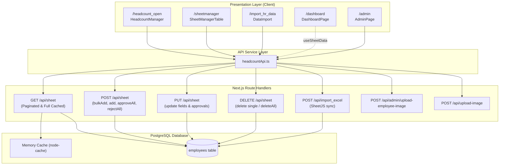

# PHASE 12A — HEADCOUNT: AUDIT + DOMAIN TYPES + API SERVICE

> **Project:** `Orgchart_TTI_onprem`  
> **Brand / Factory:** Milwaukee Tool / Techtronic Industries (TTI) Vietnam  
> **Phase:** 12A — Headcount Domain Audit, Domain Types, API Service, Direct Fetch Migration  
> **Status:** Completed  
> **Primary Rule:** `behavior preservation > data correctness > API contract preservation > architecture > line-count reduction`

---

## 1. Exact Routes

The Headcount domain spans five primary routes and integrated views within the application:

| Route URL | Entry File | Description | Core Components |
|---|---|---|---|
| `/headcount_open` | `src/app/headcount_open/page.tsx` | Open Vacancy & Headcount Planning management | `HeadcountManager.tsx`, `HeadcountAddModal.tsx`, `HeadcountEditModal.tsx` |
| `/sheetmanager` | `src/app/sheetmanager/page.tsx` | Full employee roster management, inline edits & approval workflow | `SheetManagerTable.tsx`, `SheetAddModal.tsx` |
| `/import_hr_data` | `src/app/import_hr_data/page.tsx` | Excel HR batch upload and WebP employee avatar batch upload | `DataImport.tsx` |
| `/dashboard` | `src/app/dashboard/page.tsx` | Headcount analytics, seniority breakdown, tenure & roster charts | `Multi_card.tsx`, `Column_chart_seniority.tsx`, `Donutchart_byType.tsx`, `bar_chart_BU_Org_3.tsx`, `Emp_table.tsx`, `PaginatedEmpTable.tsx`, `upcoming_resign_table.tsx`, filters |
| `/admin` | `src/app/admin/page.tsx` | Admin control panel featuring pending line-manager change reviews | Integrated tabs embedding `DataImport` & `SheetManagerTable` + live pending badge |

---

## 2. Files Audited & Original Line Counts

| File Path | Original Line Count | Role / Responsibility |
|---|---|---|
| `src/app/headcount_open/page.tsx` | 26 | Entry point with viewer role redirection |
| `src/components/HeadcountManager.tsx` | 701 | Open headcount manager with grouping, bulk create, inline edit, delete |
| `src/components/HeadcountAddModal.tsx` | 204 | Modal dialog for creating new vacant headcount positions |
| `src/components/HeadcountEditModal.tsx` | 204 | Modal dialog for updating position details and target quantity |
| `src/app/sheetmanager/page.tsx` | 26 | Entry point with viewer role redirection |
| `src/components/SheetManagerTable.tsx` | 1,150 | Full employee table, cell inline edits, approvals, image upload, deletion |
| `src/components/SheetAddModal.tsx` | 203 | Modal dialog for adding single employee to database |
| `src/app/import_hr_data/page.tsx` | 33 | Entry point with viewer role redirection |
| `src/components/DataImport.tsx` | 433 | Excel import workflow with SheetJS & employee avatar WebP conversion |
| `src/app/dashboard/page.tsx` | 376 | Executive headcount dashboard layout, filter coordinating state |
| `src/app/dashboard/components/DashboardContainer.tsx` | 18 | Fixed viewport dashboard layout shell |
| `src/app/dashboard/components/Multi_card.tsx` | 152 | Summary KPI cards (Total, Staff, IDL, DL, New Hires, Resignations) |
| `src/app/dashboard/components/Column_chart_seniority.tsx` | 137 | ApexCharts column chart for employee tenure/seniority brackets |
| `src/app/dashboard/components/Donutchart_byType.tsx` | 124 | ApexCharts donut chart for Staff / IDL / DL proportion |
| `src/app/dashboard/components/bar_chart_BU_Org_3.tsx` | 112 | ApexCharts horizontal bar chart for BU Org 3 distribution |
| `src/app/dashboard/components/Emp_table.tsx` | 190 | In-memory filtered employee table with tenure badges |
| `src/app/dashboard/components/PaginatedEmpTable.tsx` | 217 | Server-side paginated employee table for zero-filter state |
| `src/app/dashboard/components/upcoming_resign_table.tsx` | 139 | Table listing employees with upcoming last working days |
| `src/app/dashboard/components/ManagerFilter.tsx` | 186 | Hierarchical drilldown selector by manager |
| `src/app/dashboard/components/TitleFilter.tsx` | 104 | Dropdown filter for job titles |
| `src/app/dashboard/components/BUFilter.tsx` | 104 | Dropdown filter for BU Org 3 |
| `src/hooks/useSheetData.ts` | 141 | SWR hook fetching full employee list & building hierarchy |
| `src/hooks/usePaginatedSheetData.ts` | 132 | SWR hook for server-side paginated employee records |
| `src/app/admin/page.tsx` | 211 | Admin overview page displaying real-time pending approvals badge |
| `src/app/api/sheet/route.ts` | 570 | Main REST handler for employees (GET, POST, PUT, DELETE) |
| `src/app/api/import_excel/route.ts` | 228 | SheetJS Excel import, filtering, and full-sync transaction |
| `src/app/api/admin/upload-employee-image/route.ts` | 61 | Local filesystem upload for employee WebP images |
| `src/app/api/upload-image/route.ts` | 72 | Alternate image upload route handling WebP employee avatars |

---

## 3. Domain Entities

The Headcount domain is organized around the following concrete entities:

1. **HeadcountEmployee (`employees` table)**
   - Database record storing personal info, job title, department, BU, employment type (`dl_idl_staff`), location, supervisor hierarchy (`line_manager`), joining date, last working day, and employment status.
   - Distinct values:
     - `employee_type`: `'hc_open'` (vacant planned positions) vs standard employee types (`'Regular'`, `'Contract'`, etc.).
     - `status`: `'Active'`, `'Resigned'`, or `NULL` (treated as active).
     - `dl_idl_staff`: `'DL'`, `'IDL'`, `'STAFF'`.

2. **Open Headcount Position (`HeadcountOpenRow`)**
   - Headcount positions pre-registered for recruitment planning.
   - Identified by `employee_type = 'hc_open'` and `emp_id` pattern `HC-${timestamp}-${index}`.
   - Form field aliases used in forms: `"FullName " = 'Vacant Position'`, `"Job Title"`, `"Dept"`, `"Line Manager"`, `"Is Direct"`, `"Joining\r\n Date"`, `"Cost Center"`, `"Location"`.

3. **Grouped Headcount Position (`GroupedHeadcountRow`)**
   - Client-side grouping of identical vacant positions sharing the same Job Title, Dept, Line Manager, Is Direct, Cost Center, Location, and DL/IDL/Staff category.
   - Displays aggregated `quantity = ids.length`.

4. **Line Manager Change Request (`line_manager_status`)**
   - Approval workflow entity embedded in employee records.
   - Statuses: `'pending'`, `'approved'`, `'rejected'`.
   - Fields: `pending_line_manager` (target supervisor ID/name), `requester` (user submitting the change), `line_manager_status`.

5. **HR Batch Import Sync (`ImportExcelResult`)**
   - Batch synchronization record tracking uploaded Excel files, filtered rows, inserted records, updated records, and deleted orphan records.

6. **Employee Avatar Asset (`UploadImageResult`)**
   - WebP image assets resized client-side (to 225x300 ratio) and stored on on-premise local filesystem (`D:\Images emp\uploads` or `~/Desktop/uploads` or `./uploads`).

---

## 4. Data Flow



---

## 5. API Inventory

| Endpoint | Method | Query / Route Params | Body / Payload | Response Schema | Consumers |
|---|---|---|---|---|---|
| `/api/sheet` | `GET` | `page`, `limit`, `id`, `Dept`, `BU`, `DL/IDL/Staff`, `Job Title`, `Location`, `FullName `, `Emp ID`, `Employee Type`, `Line Manager`, `Is Direct`, `lineManagerStatus` | None | `{ success, data, page, limit, total, totalPages, headers }` or `{ success, data: singleEmployee }` | `headcountApi.getEmployees()`, `headcountApi.getEmployeeById()`, `headcountApi.getPendingCount()` |
| `/api/sheet` | `POST` | None | `{ action: 'bulkAddHeadcount', quantity, data }` | `{ success: true, count, message }` | `headcountApi.bulkAddHeadcount()` |
| `/api/sheet` | `POST` | None | `{ action: 'add', data }` | `{ success: true, id, message }` | `headcountApi.addEmployee()` |
| `/api/sheet` | `POST` | None | `{ action: 'approveAll' }` | `{ success: true, count, message }` | `headcountApi.approveAllPending()` |
| `/api/sheet` | `POST` | None | `{ action: 'rejectAll' }` | `{ success: true, count, message }` | `headcountApi.rejectAllPending()` |
| `/api/sheet` | `PUT` | None | `{ id, data }` | `{ success: true, message }` | `headcountApi.updateEmployee()` |
| `/api/sheet` | `DELETE` | `?id={id}` | None | `{ success: true, message }` | `headcountApi.deleteEmployee()` |
| `/api/sheet` | `DELETE` | `?deleteAll=true` | None | `{ success: true, count, message }` | `headcountApi.deleteAllEmployees()` |
| `/api/import_excel` | `POST` | None | `FormData` with `file: File` | `{ success: true, total, saved, deleted }` | `headcountApi.importExcel()` |
| `/api/admin/upload-employee-image` | `POST` | None | `FormData` with `file: Blob, filename: string` | `{ success: true, message, path }` | `headcountApi.uploadEmployeeImage()` |
| `/api/upload-image` | `POST` | None | `FormData` with `file: Blob, filename: string` | `{ success: true, message, url }` | `headcountApi.uploadImage()` |

---

## 6. API Contracts & Payloads

### `GET /api/sheet` (Paginated)
- Query parameters are dynamically sanitized and mapped to SQL columns via `FILTER_MAPPING`.
- SQL Where clause default: `(status = 'Active' OR status IS NULL)`.
- When `lineManagerStatus` is specified, uses exact match `$x = line_manager_status`.
- Response contains transformed keys matching client table expectations (`"Emp ID"`, `"FullName "`, `"Job Title"`, `"Dept"`, `"BU"`, `"DL/IDL/Staff"`, `"Location"`, `"Employee Type"`, `"Line Manager"`, `"Is Direct"`, `"Joining\r\n Date"`, `"Last Working\r\nDay"`, `lineManagerStatus`, `pendingLineManager`, `requester`, `Status`).

### `POST /api/sheet` (`action: bulkAddHeadcount`)
```json
{
  "action": "bulkAddHeadcount",
  "quantity": 5,
  "data": {
    "Job Title": "Quality Engineer",
    "Dept": "QA",
    "BU": "MILWAUKEE",
    "DL/IDL/Staff": "STAFF",
    "Location": "SHTP",
    "Line Manager": "500123",
    "Is Direct": "YES",
    "Joining\r\n Date": "2026-10-15T00:00:00.000Z",
    "employee_type": "hc_open"
  }
}
```

### `POST /api/import_excel`
- Accepts `multipart/form-data` with `file`.
- Reads worksheet 0 via SheetJS.
- Filters rows strictly according to Milwaukee Factory rules (see Section 10).
- Employs transactional batch write (`BEGIN` -> Insert/Update -> Delete orphans -> `COMMIT`).
- Invalidates cache prefix `employees`.

---

## 7. Headcount Formulas & Business Calculations

### Actual Headcount
- **Active Filter:** Employees where `status = 'Active' OR status IS NULL`.
- Employees with non-null `status` other than `'Active'` (e.g. `'Resigned'`, `'Terminated'`) are excluded from active headcount calculations.

### Workforce Categorization (`DL/IDL/Staff`)
- **Staff:** `dl_idl_staff.toLowerCase().includes('staff')`
- **IDL (Indirect Labor):** `dl_idl_staff.toLowerCase().includes('idl')`
- **DL (Direct Labor):** Non-staff and non-IDL employees (`!includes('staff') && !includes('idl')`).

### Seniority & Tenure Calculation
Formula evaluated against `joining_date`:
1. If numeric or regex `^\d+$`: Treated as Excel serial days with epoch `1899-12-30`:  
   `startDate = new Date(new Date(1899, 11, 30).getTime() + Number(joiningDate) * 86400000)`
2. If format `DD/MM/YYYY`: parsed into `(year, month - 1, day)`.
3. Standard ISO / string date parsing: `new Date(joiningDate)`.
4. Difference calculation:
   - Calculate full years and months elapsed relative to `new Date()`.
   - Seniority Brackets:
     - `< 1 year`
     - `1 - 3 years`
     - `3 - 5 years`
     - `> 5 years`

### Open Headcount & Vacancies
- Differentiated by `employee_type = 'hc_open'` and `emp_id LIKE 'HC-%'`.
- Grouping: Aggregated on the client by unique tuple:
  `[title, dept, manager, isDirect, costCenter, location, dlIdlStaff, lastWorkingDay]`.
- Total vacant positions in a group = `group.ids.length`.
- Updating target quantity:
  - If `newQuantity > currentCount`: Add `newQuantity - currentCount` records via `bulkAddHeadcount`.
  - If `newQuantity < currentCount`: Delete excess records via `deleteEmployee` for IDs beyond `newQuantity`.
  - Update remaining records via `updateEmployee`.

### Hierarchical Traversal
- Subordinates retrieved recursively via `getSubordinatesRecursive(nodes, managerId)`.
- Traversal maintains a `visited` Set to prevent infinite loops from circular reporting chains.

---

## 8. Date Logic & Normalization

The Headcount domain handles multiple date representations originating from Excel files, database timestamps, and client datepickers:
1. `Joining\r\n Date` / `Joining Date`
2. `Last Working\r\nDay` / `Last Working Day` / `Resignation Date` / `LWD`

### Handling Rules
- In form inputs: Date string `YYYY-MM-DD` converted to ISO string `new Date(value).toISOString()`.
- Display formatting: Formatted to `DD/MM/YYYY` using `formatDate`.
- Excel date serial integers preserved during Excel import without destructive normalization.

---

## 9. Filters Inventory

### Dashboard Filters (`/dashboard`)
| Filter | State Variable | Type | Target Fields |
|---|---|---|---|
| Hierarchy / Manager | `selectedManagerId` | string \| number \| null | Recursively filters nodes reporting to manager |
| Job Title | `filters.title` | string \| null | Matches all whitespace-separated keywords against `Job Title` |
| Business Unit | `filters.bu` | string \| null | Exact match against `BU Org 3` |
| Category | `filters.category` | `'staff' \| 'idl' \| null` | Substring match against `DL/IDL/Staff` |
| Employee Type | `filters.employeeType` | string \| null | Partition filter for DL, IDL, or Staff |
| Tenure | `filters.tenure` | string \| null | Seniority bracket filter |

### Sheet Manager & Headcount Open Filters
- Debounced text search (300ms debounce) for table column headers (`Dept`, `BU Org 3`, `Job Title`, `DL/IDL/Staff`, `Location`, `Line Manager`, etc.).
- Approval Toggle: `lineManagerStatus = 'pending'` filter.
- Server-side parameter forwarding to `/api/sheet`.

---

## 10. Excel Import Behavior & Protected Business Rules

Located in `src/app/api/import_excel/route.ts`:
1. **Worksheet Selection:** Always reads sheet 0 (`workbook.Sheets[workbook.SheetNames[0]]`).
2. **Filtering Whitelist Criteria:**
   ```ts
   (["SHTP", "DDK", "SHTP-3F", "SHTP-5F"].includes(location)) &&
   (type === "IDL" || type === "STAFF") &&
   bu === "MILWAUKEE" &&
   buOrg2 === "POWER TOOL"
   ```
3. **Protected Employee Rule (`500011`):**
   - Employee ID `500011` (VP) is strictly protected: **never updated and never deleted** during full sync import.
4. **Conditional Line Manager Overwrite Protection:**
   - If Excel `Is Direct === "NO"` OR existing DB record has `is_direct === "NO"`, the `line_manager` column is **not overwritten** from Excel.
5. **Full Synchronization Deletion:**
   - Employees existing in the database but absent from the imported file are removed.
   - Deletions are chunked in batches of 1,000 IDs to avoid database parameter limits.
6. **Transactional Safety:** Full batch execution wrapped inside `BEGIN` / `COMMIT` with automatic `ROLLBACK` on failure.

---

## 11. Export Behavior

- Roster tables (`HeadcountManager` and `SheetManagerTable`) operate with internal pagination/filtering; client-side Excel export is handled on `/visitoradmin` and `/visitoranalytics`.
- Direct SheetJS export is NOT enabled on `/sheetmanager` or `/headcount_open`.

---

## 12. RBAC & Access Control

1. **Viewer Restriction:**
   - Routes `/headcount_open`, `/sheetmanager`, `/import_hr_data` inspect `session.user.role`.
   - If `role === 'viewer'`, user is immediately redirected to `/`.
2. **Admin Role Requirement:**
   - Route `/admin` verifies `session.user.role === 'admin' || session.user.orgchart_role === 'admin'`.
   - Non-admin users are redirected to `/login` or `/access-denied`.
3. **Approver / User Role:**
   - Can submit line manager changes which enter `line_manager_status = 'pending'`.
   - Only admin can trigger `approveAll` or `rejectAll`.

---

## 13. Existing Types

- `src/types/database.ts`: PostgreSQL schema types for `employees` and `users`.
- `src/types/orgchart.types.ts`: BalkanGraph node structures (`OrgChartNode`, `CoreTeamEmployee`).

---

## 14. Existing Hooks

- `src/hooks/useSheetData.ts`: Full employee fetch with 15-minute SWR caching and hierarchy node transformation.
- `src/hooks/usePaginatedSheetData.ts`: Server-side paginated SWR hook for 10-20 items per page with page navigation handlers.

---

## 15. Domain Types Created

Created in `src/types/headcount.types.ts`:
- `HeadcountEmployee`: Strict DB representation with all 19 columns.
- `SheetEmployeeRow`: Client-side spreadsheet row model with whitespace/newline column keys.
- `GroupedHeadcountRow`: Grouped open position model with aggregated IDs and quantities.
- `HeadcountQueryParams`: Query parameter definition for `/api/sheet`.
- `HeadcountFilterState`: Active filter state for Headcount Dashboard.
- `HeadcountDashboardFilter`: Legacy union filter for dashboard components.
- `BulkAddHeadcountPayload`: Payload for bulk open position creation.
- `AddEmployeePayload`, `UpdateEmployeePayload`: Payloads for employee mutation.
- `PaginatedEmployeesResponse`, `SingleEmployeeResponse`: Strictly typed API responses.
- `HeadcountActionResponse`: Mutation response structure with count and message.
- `ImportExcelResult`: Excel import sync metrics (total, saved, deleted).
- `UploadImageResult`: Avatar upload response structure.

> [!NOTE]
> All types defined with **zero `any`** and full type safety.

---

## 16. API Service Created

Created in `src/features/headcount/services/headcountApi.ts`:
- `buildSheetQueryUrl(params)`: Encapsulates query URL construction for SWR.
- `getPaginatedSheetUrl(page, limit)`: Encapsulates pagination URL construction for SWR prefetch.
- `getEmployees(params?, signal?)`
- `getEmployeeById(id, signal?)`
- `addEmployee(data, signal?)`
- `bulkAddHeadcount(quantity, data, signal?)`
- `updateEmployee(id, data, signal?)`
- `deleteEmployee(id, signal?)`
- `deleteAllEmployees(signal?)`
- `approveAllPending(signal?)`
- `rejectAllPending(signal?)`
- `importExcel(file, signal?)`
- `uploadEmployeeImage(file, filename, signal?)`
- `uploadImage(file, filename, signal?)`
- `getPendingCount(signal?)`

---

## 17. Component Candidates for Phase 12B Extraction

The following components currently residing in monolithic files are identified for extraction in Phase 12B:
1. `src/features/headcount/components/HeadcountOpenTable.tsx` (extracted from `HeadcountManager.tsx`)
2. `src/features/headcount/components/HeadcountOpenFilters.tsx` (extracted from `HeadcountManager.tsx`)
3. `src/features/headcount/components/SheetManagerTableCore.tsx` (extracted from `SheetManagerTable.tsx`)
4. `src/features/headcount/components/SheetManagerFilters.tsx` (extracted from `SheetManagerTable.tsx`)
5. `src/features/headcount/components/SheetApprovalConfirmModal.tsx` (extracted from `SheetManagerTable.tsx`)
6. `src/features/headcount/components/ExcelDataUploadCard.tsx` (extracted from `DataImport.tsx`)
7. `src/features/headcount/components/ImageBatchUploadCard.tsx` (extracted from `DataImport.tsx`)

---

## 18. Technical Debt Documented

1. **Column Aliases with Non-standard Whitespace & Newlines:**
   - Keys such as `"FullName "`, `"Joining\r\n Date"`, `"Last Working\r\nDay"`, `"DL/IDL/Staff"` are embedded deeply in table components and Excel parsers.
2. **Dual Image Upload Endpoints:**
   - `/api/admin/upload-employee-image` and `/api/upload-image` perform near-identical work, writing to local disk directories.
3. **Client-side Grouping Simulation:**
   - `HeadcountManager.tsx` queries with `limit=2000` to fetch "all" open headcount records and group them on the browser thread.
4. **Direct Mutation in Loops:**
   - `handleSaveAll` executes multiple sequential or parallel `PUT /api/sheet` calls rather than a single bulk update endpoint.

---

## 19. Risks & Mitigations

| Risk | Mitigation |
|---|---|
| Overwriting line managers on HR Excel import | Preserved strict `is_direct === 'NO'` check from both Excel and database. |
| Accidental deletion of Executive ID `500011` | Preserved hardcoded guard in `import_excel/route.ts`. |
| SWR cache stale after bulk mutations | SWR `mutate()` calls preserved after every service call. |
| UI layout shift or breaking inline styles | Zero UI changes executed in Phase 12A. All changes isolated to service layer. |

---

## 20. Protected Contracts Checklist

- [x] Route URLs preserved (`/headcount_open`, `/sheetmanager`, `/import_hr_data`, `/dashboard`, `/admin`).
- [x] API endpoint paths preserved (`/api/sheet`, `/api/import_excel`, `/api/admin/upload-employee-image`, `/api/upload-image`).
- [x] API request/response payloads preserved.
- [x] Database schema & columns preserved.
- [x] Protected infrastructure files untouched (`src/lib/orgchart.js`, `src/middleware.ts`, `src/lib/authOptions.ts`, `src/lib/db.ts`, `src/lib/visitor-db.ts`, `nginx.conf`, `ecosystem.config.js`, `.env.local`).
- [x] Zero direct `fetch()` calls remain in Headcount app routes or components.
